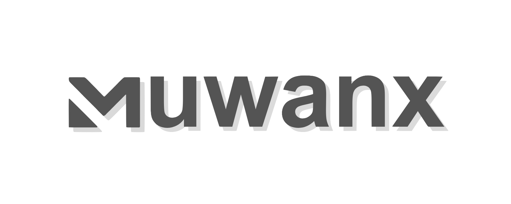

<div align="center">
  
</div>
<div align="center">
    <em>Real-time Interactive AI Robot Simulation in Your Browser</em>
</div>

<br>

<p align="center">
    <a href="https://github.com/ttktjmt/muwanx/actions/workflows/deploy.yml"></a>
    <a href="https://github.com/ttktjmt/muwanx/blob/main/LICENSE"></a>
    <a href="https://www.npmjs.com/package/muwanx"></a>
    <a href="https://deepwiki.com/ttktjmt/muwanx"></a>
    <a href="https://ttktjmt.github.io/muwanx/"></a>

</p>

---

**Muwanx** is a browser-based mujoco playground built on top of [**MU**joco **WA**sm](https://github.com/google-deepmind/mujoco/tree/main/wasm), [on**NX** runtime](https://github.com/microsoft/onnxruntime), and [three.js](https://github.com/mrdoob/three.js/). It enables MuJoCo simulations with real-time trained policy control, running entirely in the browser - no server for simulation required.  
Perfect for sharing interactive demos as static sites (which can be hosted on GitHub Pages), rapidly prototyping RL policies, or building customizable environments for experimentation and visualization.


### 🚀 [Visit the Live Demo](https://ttktjmt.github.io/muwanx/)

**╰▶ [Live Demo: MyoSuite](https://ttktjmt.github.io/muwanx/#/myosuite)** &nbsp;&nbsp;© [MyoSuite](https://github.com/MyoHub/myosuite)  
**╰▶ [Live Demo: MuJoCo Menagerie](https://ttktjmt.github.io/muwanx/#/mujoco_menagerie)** &nbsp;&nbsp;© [Google DeepMind](https://github.com/google-deepmind/mujoco_menagerie)  
**╰▶ [Live Demo: MuJoCo Playground](https://ttktjmt.github.io/muwanx/#/mujoco_playground)** &nbsp;&nbsp;© [Google DeepMind](https://github.com/google-deepmind/mujoco_playground)  

## Features
- **Real-time**: Run MuJoCo simulations with real-time policy control.
- **Interactive**: Change the state of objects by applying forces.
- **Cross-platform**: Works seamlessly on desktop and mobile devices.
- **VR Support**: Native VR viewer with WebXR for immersive simulation experiences.
- **Client-only**: All computation runs in the browser. No server for simulation is required.
- **Easy Sharing**: Host as a static site for effortless demo distribution (e.g., GitHub Pages).
- **Customizable**: Add your own MuJoCo models and ONNX policies quickly.


## Quick Start

To run muwanx locally, ensure you have [Node.js](https://nodejs.org/) installed.

Clone the repository:
```bash
git clone https://github.com/ttktjmt/muwanx.git
cd muwanx
```

Install the dependencies and start the development server:
```bash
npm install
npm run dev
```

Open your browser and navigate to the localhost URL shown in the terminal.


## Usage as an npm Package

Muwanx is available as an [npm package](https://www.npmjs.com/package/muwanx) with a customizable API.

### Installation

```bash
npm install muwanx
```

### Basic Usage

Muwanx provides two API patterns:

#### Pattern A: Declarative (Load from Configuration)

Load viewer configuration from a JSON file:

```typescript
import { MwxViewer } from 'muwanx';

const viewer = new MwxViewer('#mujoco-container');
await viewer.loadConfig('./config.json');

// Control the simulation
viewer.play();
viewer.pause();
await viewer.reset();
```

**Configuration Example:**

```json
{
  "projects": {
    "project_name": "My Robotics Project",
    "project_link": "https://github.com/username/project",
    "scenes": [
      {
        "id": "scene1",
        "name": "Locomotion Scene",
        "model_xml": "./assets/scene/robot/scene.xml",
        "asset_meta": "./assets/scene/robot/asset_meta.json",
        "camera": {
          "position": [2.0, 1.7, 1.7],
          "target": [0, 0.2, 0],
          "fov": 45
        },
        "policies": [
          {
            "id": "policy1",
            "name": "Walking Policy",
            "path": "./assets/policy/walking.json",
            "stiffness": 25.0,
            "damping": 0.5
          }
        ]
      }
    ]
  }
}
```

#### Pattern B: Imperative (Programmatic Construction)

Build the viewer programmatically with method chaining:

```typescript
import { MwxViewer } from 'muwanx';

const viewer = new MwxViewer('#mujoco-container');

// Build programmatically
const project = viewer.addProject({
  project_name: "My Robotics Project",
  project_link: "https://github.com/username/project"
});

const scene = project.addScene({
  id: "scene1",
  name: "Locomotion Scene",
  model_xml: "./assets/scene/robot/scene.xml",
  asset_meta: "./assets/scene/robot/asset_meta.json",
  camera: {
    position: [2.0, 1.7, 1.7],
    target: [0, 0.2, 0]
  }
});

const policy = scene.addPolicy({
  id: "policy1",
  name: "Walking Policy",
  path: "./assets/policy/walking.json",
  stiffness: 25.0,
  damping: 0.5
});

// Initialize and load
await viewer.initialize();
await viewer.selectScene('scene1');
await viewer.selectPolicy('policy1');
```

### Event Handling

Listen to viewer events:

```typescript
viewer.on('scene-changed', ({ scene }) => {
  console.log('Scene loaded:', scene.name);
});

viewer.on('policy-changed', ({ policy }) => {
  console.log('Policy loaded:', policy.name);
});

viewer.on('params-changed', ({ params }) => {
  console.log('Parameters updated:', params);
});

viewer.on('error', ({ error, context }) => {
  console.error(`Error in ${context}:`, error);
});
```

### Runtime Control

Update simulation parameters dynamically:

```typescript
viewer.updateParams({
  lin_vel_x: 1.0,      // Forward velocity (m/s)
  lin_vel_y: 0.0,      // Lateral velocity (m/s)
  ang_vel_z: 0.5,      // Angular velocity (rad/s)
  stiffness: 25.0,     // PD controller stiffness
  damping: 0.5,        // PD controller damping
});
```

### TypeScript Support

Full TypeScript type definitions included:

```typescript
import type {
  ViewerConfig,
  ProjectConfig,
  SceneConfig,
  PolicyConfig,
  RuntimeParams,
  AssetMetadata,
} from 'muwanx';
```

### Examples

See the `examples/` directory for complete examples:
- **Declarative Example**: `examples/declarative/` - Load from config JSON
- **Imperative Example**: `examples/imperative/` - Programmatic construction
- **Vue Demo**: `examples/` - Full-featured Vue.js application

### API Reference

**MwxViewer Class:**
- `loadConfig(config)` - Load configuration from object or URL
- `addProject(config)` - Add project programmatically
- `initialize()` - Initialize MuJoCo runtime
- `selectProject(id)` - Switch to project
- `selectScene(id)` - Load scene
- `selectPolicy(id)` - Load policy
- `play()` - Start simulation
- `pause()` - Pause simulation
- `reset()` - Reset simulation
- `updateParams(params)` - Update runtime parameters
- `getProjects()` - Get all projects
- `getScenes()` - Get scenes for current project
- `getPolicies()` - Get policies for current scene
- `on(event, callback)` - Add event listener
- `off(event, callback)` - Remove event listener

For detailed API documentation, see [examples/README.md](examples/README.md).

### Advanced Usage

For advanced use cases, you can access lower-level components:

```typescript
import {
  MujocoRuntime,
  IsaacActionManager,
  ObservationManager,
  ONNXModule
} from 'muwanx';

// Access the underlying runtime
const runtime = viewer.getRuntime();

// Direct access to MuJoCo model and data
const mjModel = runtime.mjModel;
const mjData = runtime.mjData;
```

## Third-Party Assets

Muwanx incorporates mujoco models from the external sources in its demo. See the respective submodule for full details, including individual model licenses and copyrights. All models are used under their respective licenses. Please review and comply with those terms for any use or redistribution.

[MyoSuite License](https://github.com/MyoHub/myosuite/blob/main/LICENSE) ･ [MuJoCo Menagerie License](https://github.com/google-deepmind/mujoco_menagerie/blob/main/LICENSE) ･ [MuJoCo Playground License](https://github.com/google-deepmind/mujoco_playground/blob/main/LICENSE)

## Acknowledgments

This project was greatly inspired by the [Facet project demo](https://facet.pages.dev/) from the research group at Tsinghua University.  
It is also built upon the excellent work of [zalo/mujoco_wasm](https://github.com/zalo/mujoco_wasm), one of the earliest efforts to run MuJoCo simulations in a browser.

## License

This project is licensed under the [Apache-2.0 License](./LICENSE).
