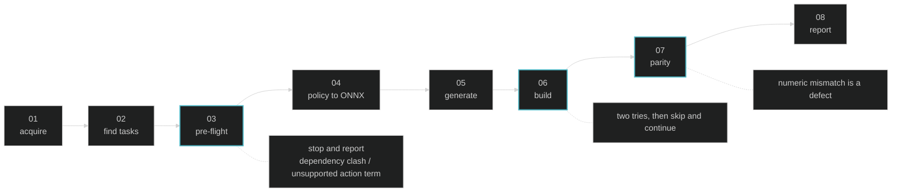

# mjlab-to-mjswan

An agent skill that ports any mjlab task into a browser app built by [mjswan](https://github.com/ttktjmt/mjswan). The target could be a local path or a GitHub URL.

A local path is used as is; a GitHub URL is cloned into the working directory. Either way the skill generates `mjswan_app/` inside the target repo.

## Usage

E.g., **Claude Code**

```
/plugin marketplace add ttktjmt/mjswan
/plugin install mjswan@ttktjmt
```

Then invoke it with the target repo:

```
/mjswan:mjlab-to-mjswan https://github.com/mujocolab/g1_spinkick_example
```

Any other agent can follow `SKILL.md` directly, it is plain Markdown with no vendor-specific syntax.

Either way the agent needs `git` and a Python 3.10-3.12 environment in which the target repo's task registrations import; it installs `mjswan torch onnxruntime` into that environment itself.

## The pipeline

Eight stages, three of them gates. `03` costs seconds and answers "not portable" before anything expensive runs; `06` and `07` cost minutes.



## What parity proves, and what it does not

A successful build only proves every term *traced*. `run_parity`, the harness mjswan's own CI runs, catches a term that traced but computes the wrong numbers.

The same raw state goes to both sides and the outputs are compared, so what is proven is that the graph reproduces mjlab's term, nothing more. How a policy trained under `mujoco_warp` behaves under the browser's WASM integration lies outside that line, and the skill says so in its report.

## What gets generated

```
mjswan_app/
  main.py           builder wiring; the only entry point
  terms.py          register_* replacements (only when the build needs one)
  export_policy.py  .pt to ONNX converter   (local checkpoints only)
  model_*.onnx      converted checkpoints
  policy_meta.json  checkpoint order + metadata
  README.md         source URL, prerequisites, run command
```

Run it from the repo root with `python -m mjswan_app.main`.

## What it will not write

- **TypeScript (`ts_src`)**: a `uses_custom_js` build cannot be published to mjswan Cloud.
- **`ViewerConfig`**: a camera cannot be judged without looking at it, so the default stands.
- **mjswan itself**, with one exception: a missing capability other tasks would need too becomes a pull request against mjswan. A gap only this task has never does.
